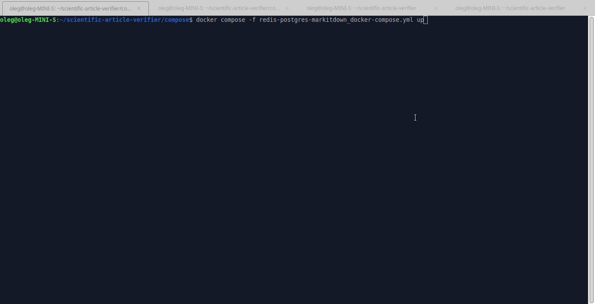
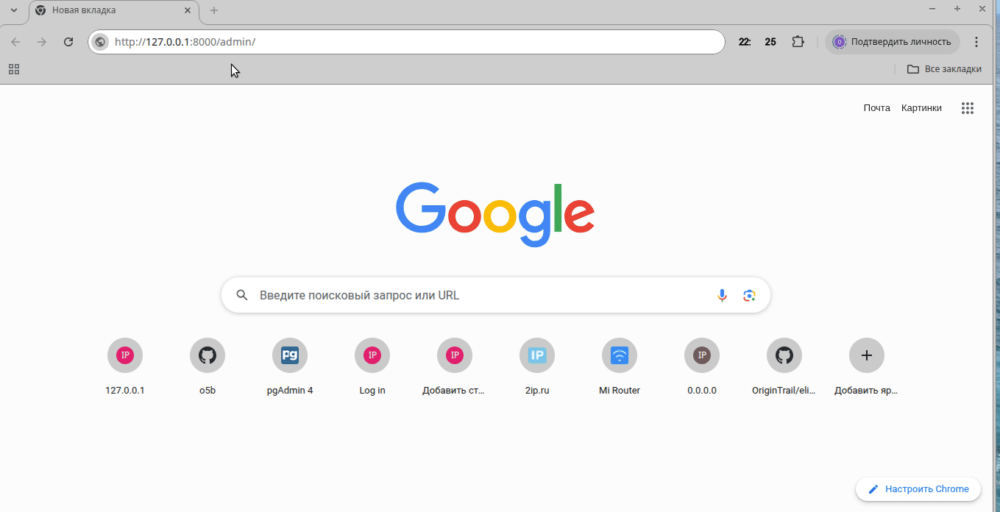
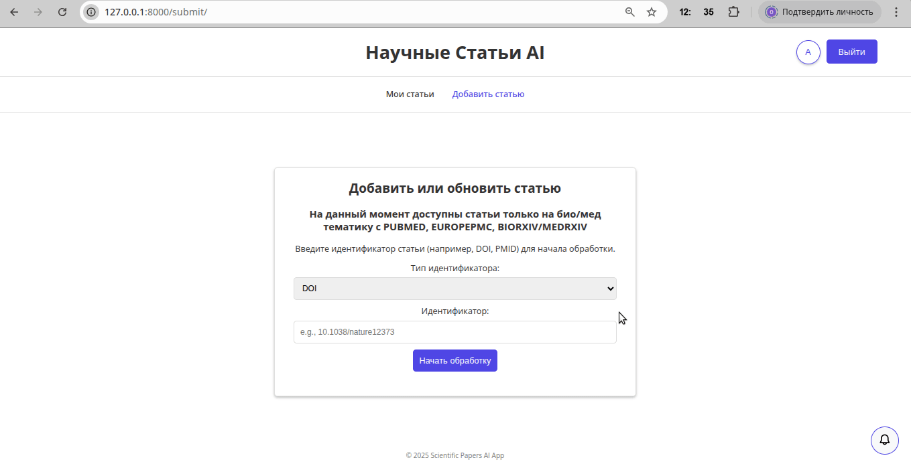
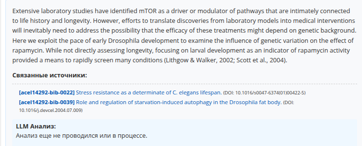
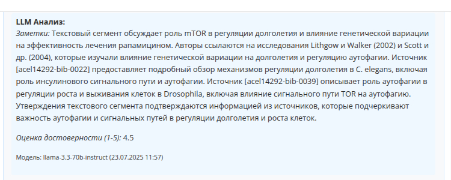
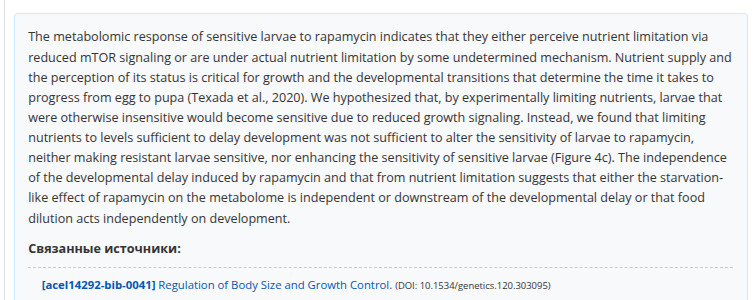
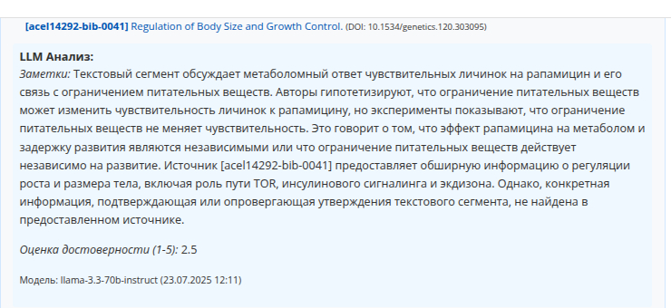

# Ru: Приложение для проверки качества научных статей

На основе `Python3.12` и `Ubuntu 24.04.2 LTS`

Данное приложение автоматизирует проверку на правдивость научной статьи путём анализа цитируемых материалов на которые она ссылается.

В веб-интерфейсе вводиться `DOI` проверяемой статьи по которому на разных научных ресурсах (crossref, pubmed, europepmc, biorxiv/medrxiv, sci-hub, orcid.org) производиться поиск данных (метаданные, полный текст статьи в xml формате, pdf-файл статьи).

Из полученного структурированного варианта статьи извлекается текст, который разбивается на анализируемые сегменты (в текущем варианте это параграфы), а так же извлекаются ссылки цитирования, которые связываются с соответствующим сегментом.

Для каждой извлечённой ссылки производится поиск её `DOI` (api.crossref.org) и далее по найденному `DOI` ищется доступная информация (метаданные, текст статьи, pdf-файлы). Полученные данные из xml и pdf форматов конвертируются в текст для дальнейшей обработки в LLM.

Если необходимо оценить какой либо сегмент статьи, то его текст вместе с текстом связанных статей в виде промпта отправляется в LLM с указанием проверить подтверждается ли сегмент и оценить это от 0 до 5.

Такая проверка может облегчить исследователям работу с научными статьями. Как один из вариантов использования, на основе проверенных статей, AI-агенты смогут генерировать более качественные научные гипотезы.

## Установка

Для установки необходимо в консоли выполнить следующие команды:

```bash
git clone https://github.com/o5b/scientific-article-verifier.git
cd scientific-article-verifier
python3.12 -m venv venv
source venv/bin/activate
pip install -r requirements/base.txt
```

После установки python-пакетов необходимо установить Chromium-Driver для `patchright`. Для этого нужно в консоли выполнить следующую команду:

```bash
cd scientific-article-verifier
source venv/bin/activate
patchright install chromium

```

## Подготовка к запуску

### Запуск необходимых docker-контейнеров

В приложении используются различные компоненты (бд: Redis, PostgreSQL, markitdown - для конвертации pdf в текст) запускаемые в docker. Поэтому перед стартом docker-compose должен быть установлен и настроен в системе.

Для запуска docker-контейнеров необходимо в консоли выполнить следующие команды:

```bash
cd scientific-article-verifier/compose/
docker compose -f redis-postgres-markitdown_docker-compose.yml up
```

Во время первого запуска `docker compose` пройдет сборка контейнеров и это может занять много времени, последующие запуски будут проходить быстрее.

#### Некоторые полезные docker команды

```bash
# Для отображения контейнеров:
docker ps -a
# Для отображения образов:
docker images -a
# Для остановки контейнеров связанных с файлом docker compose:
cd scientific-article-verifier/compose/
docker compose -f redis-postgres-markitdown_docker-compose.yml down
# Чтобы удалить из системы все остановленные контейнеры и неиспользуемые образы:
docker system prune -a
```

### Подготовка Django перед первым запуском

Переходим в папку проекта и активируем виртуальное окружение если ещё не сделали этого:

```bash
cd scientific-article-verifier
source venv/bin/activate
```

Создаем свой файл с секретом:

```bash
cp env.example .env
```

Заполняем его своими данными если они нужны:

```bash
# SECRET_OPENAI_API_KEY = '' # your-openai-key
# SECRET_NCBI_API_KEY = '' # your-pubmed-key
SECRET_APP_EMAIL = 'your-email'
DJANGO_SECRET_KEY = 'your-django-secret'
```

`SECRET_NCBI_API_KEY` - ключ для доступа к api pubmed, если имеется.

`SECRET_APP_EMAIL` - это почта которая отправляется во время запроса данных из различных ресурсов. Без неё сторонние сервисы могут ограничивать количество запросов.

`SECRET_OPENAI_API_KEY` - ваш ключ для доступа к api OpenAI. Если ключ отсутствует, то будет попытка отправить запрос к `Grok` (можно так же явно указать `Grok` в файле `settings.py` в настройке `LLM_PROVIDER_FOR_ANALYSIS = 'Grok'`) но данный вариант крайне не стабильный из за проверок `cloudflare.com`.

Запускаем миграции Django (`redis-postgres-markitdown_docker-compose.yml` должен уже быть запущен):

```bash
python manage.py migrate
```

Создаем суперпользователя.

```bash
python manage.py createsuperuser
```

По запросу вводим имя для админа, любую почту и свой пароль:

```bash
Username (leave blank to use 'oleg'): admin
Email address: admin@example.com
Password:
Password (again):
Superuser created successfully.
```

## Запуск приложения

Переходим в папку проекта и активируем виртуальное окружение если ещё не сделали этого:

```bash
cd scientific-article-verifier
source venv/bin/activate
```

В случае локальной разработки, чтобы не возникало проблем с отображением `CSS` стилей на странице, можно использовать `django` сервер:

```bash
python manage.py runserver
```

В производстве лучше для запуска использовать сервер `daphne`:

```bash
daphne settings.asgi:application
```

В другой консоли запускаем Celery.
Если надо, то активируем виртуальное окружение и запускаем `Celery`:

```bash
cd scientific-article-verifier
source venv/bin/activate
celery -A settings worker -l info
```



По адресу `http://127.0.0.1:8000/admin/` можно будет войти в админку сайта.

В браузере по адресу `http://127.0.0.1:8000/` будет запущено приложение, где можно будет ввести `DOI` анализируемой статьи и запустить процесс поиска и загрузки данных из сети.



Через несколько минут приложение завершит сбор доступных данных в сети.


В пользовательском веб-интерфейсе можно редактировать либо попробовать загрузить недоступные данные.



В случае успешного получения данных можно будет произвести проверку на правдивость конкретного сегмента текста из статьи с использованием LLM.

## Анализ статьи с помощью LLM

Текст анализируемого сегмента статьи № 1:



Ответ LLM № 1:



Текст анализируемого сегмента статьи № 2:



Ответ LLM № 2:

